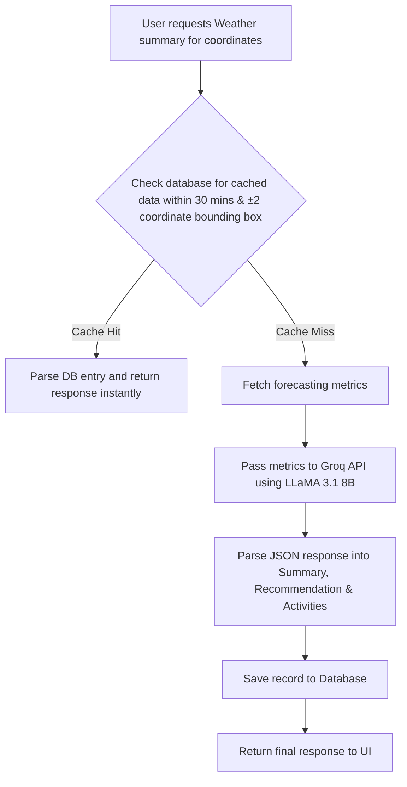

# WeatherAI: AI Summary Integration Documentation

This document provides a comprehensive guide to the AI integration layer in the WeatherAI application. It covers architecture, installation, API data flows, testing procedures, frontend consumption guides, environment variables, known limitations, and future roadmaps.

---

## 1. Overview

The AI layer enhances raw numerical weather metrics (such as temperature, humidity, and precipitation probability) by transforming them into natural-language, context-aware summaries and actionable outdoor activity recommendations. 

### Architecture Flow
The AI integration resides inside the backend controller and route handlers:
1. **Request Intake:** The application receives latitude and longitude coordinates.
2. **Database Cache Check:** The application queries the Postgres database via Prisma to check if a recent (within 30 minutes) weather summary exists within a ±2 coordinate boundary.
3. **External Weather Query:** If no cached entry exists, the application triggers a query to retrieve weather forecasting data.
4. **AI Generation:** The numerical weather metrics are formatted into a prompt and sent to the Groq API.
5. **Caching & Response:** The returned AI summary is saved back to the database for subsequent cache hits, and the final response is served to the client.

### Technology Stack
* **AI Engine:** [Groq SDK](https://github.com/groq/groq-sdk-node) powered by the **LLaMA 3.1 8B Instant** (`llama-3.1-8b-instant`) model.
* **Backend Framework:** Next.js (App Router API Routes).
* **Database & ORM:** Prisma ORM connected to a Supabase PostgreSQL instance.

---

## 2. Setup & Installation

Follow these steps to set up the repository and get the development environment running.

### Prerequisites
* **Node.js** (v18.x or higher, preferably v20+ / v22.11.0+)
* **npm** (v9.x or higher)

### Installation Steps
1. **Clone the repository:**
   ```bash
   git clone https://github.com/theoldonee/WeatherAI.git
   cd WeatherAI
   ```
2. **Install dependencies:**
   ```bash
   npm install
   ```
3. **Configure Environment Variables:**
   Create a `.env.local` file in the root directory:
   ```env
   GROQ_API_KEY=gsk_your_actual_groq_api_key_here
   ```
   *Note: Obtain your API key from the [Groq Console](https://console.groq.com).*

4. **Start the Development Server:**
   ```bash
   npm run dev
   ```
   The local server will run at `http://localhost:3000`.

---

## 3. How It Works — Step-by-Step Flow

Below is the execution flow from the moment the user interacts with the app until the final response is returned:



### Flow Breakdown
1. **User Request:** The client triggers a request containing the user's location.
2. **Database Lookup:** The `CheckDb` method in `src/controller.ts` queries the database via `src/db.ts` to locate records within a 30-minute timestamp and a coordinate grid bounding range of `[latitude ± 2]` and `[longitude ± 2]`.
3. **Forecasting Fetch:** If there's a cache miss, the `Weather` module fetches forecast details (temperature, humidity, rain probability).
4. **AI Generation:** The `generateWeatherSummary` utility in `src/ai.ts` compiles the coordinates and metrics into a prompt demanding a JSON response.
5. **Groq Call:** The Groq SDK requests completion using the `llama-3.1-8b-instant` model.
6. **Persistence:** The controller joins activities into a comma-separated string and saves the new record to PostgreSQL.
7. **Client Response:** The API returns the combined location, weather, and AI data.

### Response JSON Schema

Depending on the ingestion layer used, the response shapes behave as follows:

#### Route Handler Endpoint Response (`/api/weather`)
```json
{
  "latitude": -20.2,
  "longitude": 57.5,
  "temp": 28,
  "humidity": 40,
  "probabilityOfRain": 5,
  "summary": "Warm and pleasant with clear skies.",
  "recommendation": "Wear sunscreen and stay hydrated.",
  "suitableActivities": [
    "Hiking",
    "Cycling",
    "Running"
  ]
}
```

#### Controller Class Response (`Controller.GetResponse`)
```json
{
  "longitude": 57.5,
  "longitiude": 57.5,
  "latitude": -20.2,
  "temp": 28,
  "humidity": 40,
  "probabilityOfRain": 5,
  "summary": "Warm and pleasant with clear skies.",
  "recommendation": "Wear sunscreen and stay hydrated.",
  "suitableActivities": "Hiking, Cycling, Running"
}
```

---

## 4. How to Test the AI Layer

### Standalone CLI Verification
You can verify the AI layer integration directly from the console without running a web server.
```bash
npx tsx src/test-ai.ts
```

### The 6 Test Scenarios
To ensure robust behaviour under varying conditions, execute the following scenarios using the Next.js API endpoint:

| Scenario | Latitude | Longitude | Temp (°C) | Humidity (%) | Rain Probability (%) | Expected Context |
|---|---|---|---|---|---|---|
| **1. Sunny Day** | `-20.2` | `57.5` | `28` | `40` | `5` | Warm, low humidity, dry conditions. |
| **2. Heavy Rain** | `-20.2` | `57.5` | `22` | `95` | `90` | Wet, high humidity, indoor activities suggested. |
| **3. Hot & Humid** | `-20.2` | `57.5` | `38` | `85` | `20` | Heat warning, hydration reminders. |
| **4. Cold & Dry** | `-20.2` | `57.5` | `10` | `30` | `10` | Chilly weather, warm clothing recommendations. |
| **5. Stormy** | `-20.2` | `57.5` | `18` | `99` | `95` | Heavy rainfall, indoor-only recommendations. |
| **6. Mild Spring** | `-20.2` | `57.5` | `23` | `60` | `30` | Pleasant temperatures, standard outdoor guidelines. |

### Understanding API Responses

#### Passing Response (HTTP 200)
A successful response returns a status code of `200` and contains a populated, structured JSON block representing the metrics and the AI's generated strings.

#### Fallback Response (Failsafe Mode)
If the `GROQ_API_KEY` is not present, or if the API call throws an error (e.g. rate limits or network issues), the code catches the failure and returns a **structured fallback** from the `getFallbackSummary` utility:
* **Failsafe JSON Output:**
  ```json
  {
    "summary": "The weather is currently 24°C with 60% humidity. The weather is pleasant.",
    "recommendation": "A good day for outdoor activities.",
    "suitableActivities": [
      "Walking in the park",
      "Cycling",
      "Sightseeing"
    ]
  }
  ```
* **Indications:** Check terminal logs. A warning message `GROQ_API_KEY is not defined...` or `Failed to generate weather summary...` will indicate that the fallback triggered.

### Testing with HTTP Clients
To test using VS Code's **REST Client** extension, install the extension and open `src/test-scenarios.http`. Make sure your server is running (`npm run dev`) and click **Send Request** above any of the request headers.

Example request format:
```http
POST http://localhost:3000/api/weather
Content-Type: application/json

{
  "latitude": -20.2,
  "longitude": 57.5,
  "temp": 28,
  "humidity": 40,
  "probabilityOfRain": 5
}
```

---

## 5. Frontend Integration Guide

This guide is designed for frontend developers integrating the API into React/Next.js client views.

### API Specifications
* **Endpoint:** `POST /api/weather`
* **Content-Type:** `application/json`
* **Response payload:**
  * `summary` (string) — The primary description to display.
  * `recommendation` (string) — Advice or warnings to highlight.
  * `suitableActivities` (string[]) — An array of recommended actions.

### React Component Integration Example

```tsx
'use client';

import React, { useState } from 'react';

interface WeatherSummaryData {
  temp: number;
  humidity: number;
  probabilityOfRain: number;
  summary: string;
  recommendation: string;
  suitableActivities: string[];
}

export default function WeatherDashboard() {
  const [data, setData] = useState<WeatherSummaryData | null>(null);
  const [loading, setLoading] = useState(false);
  const [error, setError] = useState<string | null>(null);

  const fetchWeatherSummary = async () => {
    setLoading(true);
    setError(null);
    try {
      const response = await fetch('/api/weather', {
        method: 'POST',
        headers: { 'Content-Type': 'application/json' },
        body: JSON.stringify({
          latitude: 37.7749,
          longitude: -122.4194,
          temp: 24,
          humidity: 60,
          probabilityOfRain: 15,
        }),
      });

      if (!response.ok) {
        throw new Error('Failed to retrieve weather analysis');
      }

      const result = await response.json();
      setData(result);
    } catch (err: any) {
      setError(err.message || 'An unexpected error occurred');
    } finally {
      setLoading(false);
    }
  };

  return (
    <div className="p-6 max-w-lg mx-auto bg-white rounded-xl shadow-md space-y-4">
      <button
        onClick={fetchWeatherSummary}
        disabled={loading}
        className="w-full bg-blue-600 text-white py-2 px-4 rounded hover:bg-blue-700 disabled:bg-gray-400"
      >
        {loading ? 'Analyzing weather conditions (1-3s)...' : 'Get Weather Recommendation'}
      </button>

      {error && <div className="text-red-500 text-sm font-medium">{error}</div>}

      {data && (
        <div className="space-y-4 animate-fade-in">
          {/* Weather Metrics */}
          <div className="grid grid-cols-3 gap-2 text-center text-xs text-gray-500">
            <div>Temp: {data.temp}°C</div>
            <div>Humidity: {data.humidity}%</div>
            <div>Rain: {data.probabilityOfRain}%</div>
          </div>

          {/* AI Summary Card */}
          <div className="p-4 bg-zinc-50 rounded-lg border border-zinc-100">
            <h3 className="font-semibold text-zinc-800">Forecast Summary</h3>
            <p className="text-zinc-600 text-sm mt-1">{data.summary}</p>
          </div>

          {/* Recommendation Banner */}
          <div className="p-4 bg-amber-50 border-l-4 border-amber-500 rounded-r-lg">
            <h3 className="font-semibold text-amber-800">AI Advice</h3>
            <p className="text-amber-700 text-sm mt-1">{data.recommendation}</p>
          </div>

          {/* Suitable Activities list */}
          <div>
            <h3 className="font-semibold text-zinc-800 mb-2">Suitable Activities</h3>
            <ul className="flex flex-wrap gap-2">
              {data.suitableActivities.map((activity, idx) => (
                <li
                  key={idx}
                  className="bg-blue-50 text-blue-700 text-xs px-2.5 py-1 rounded-full font-medium"
                >
                  {activity}
                </li>
              ))}
            </ul>
          </div>
        </div>
      )}
    </div>
  );
}
```

### Loading States Warning
> [!IMPORTANT]
> The AI completion request takes between **1 to 3 seconds** depending on API load. Frontend implementations must display an appropriate loading state (like progress bars or skeleton components) to prevent layout shifting and enhance user experience.

---

## 6. Environment Variables Reference

| Variable | Purpose | Where to get it |
| :--- | :--- | :--- |
| `GROQ_API_KEY` | Authenticates API communication with Groq's model inference servers. | [Groq Console Api Keys Section](https://console.groq.com/keys) |

---

## 7. Known Issues & Limitations

### 1. Groq Rate Limits
The free tier of the Groq API enforces strict rate limits on RPM (Requests Per Minute) and RPD (Requests Per Day). Excessive sequential API testing may result in rate-limiting errors (`429 Too Many Requests`). When this occurs, the backend logs the error and gracefully switches to fallback mode.

### 2. Bounding Box Cache Accuracy (±2 Coordinate Range)
The coordinate checks in the database fetch query in `src/db.ts` filter locations using `latitude ± 2` and `longitude ± 2` boundaries. Since 1 degree of latitude is approximately 111 km, a ±2 degree grid spans a box of roughly 440 km × 440 km. This wide grid means locations separated by hundreds of kilometers may receive cached data generated for neighboring regions, which might not reflect hyper-local weather variations.

### 3. Missing API Key Fallback
If the application is deployed without setting `GROQ_API_KEY`, it defaults silently to local rules-based summary generations, which are less dynamic and do not adapt to coordinates.

---

## 8. Future Improvements

* **Distributed Summary Cache:** Implement Redis or Postgres-level indexing on location columns (using PostGIS/Geo-spatial indexing) to query records inside a precise circular radius rather than a raw coordinate boundary box.
* **Localization:** Add support for internationalization parameters to request translations (`es`, `fr`, `de`) directly from the model prompt.
* **Severe Weather Flagging:** Integrate high-temperature or heavy rain thresholds that automatically tag database records as "severe", triggering system alerts and prioritising storm safety guidelines in the summary cards.
